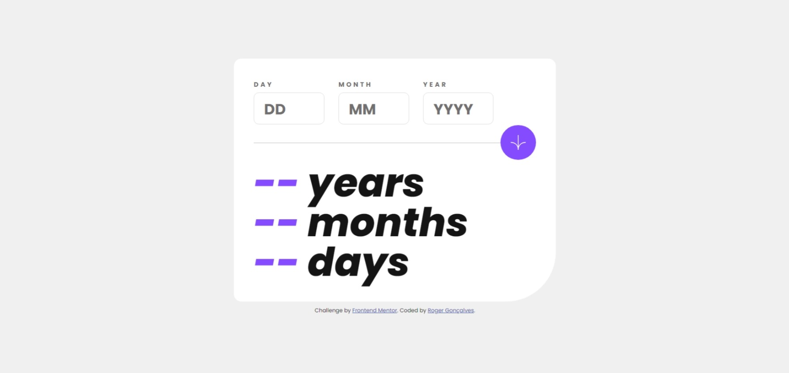
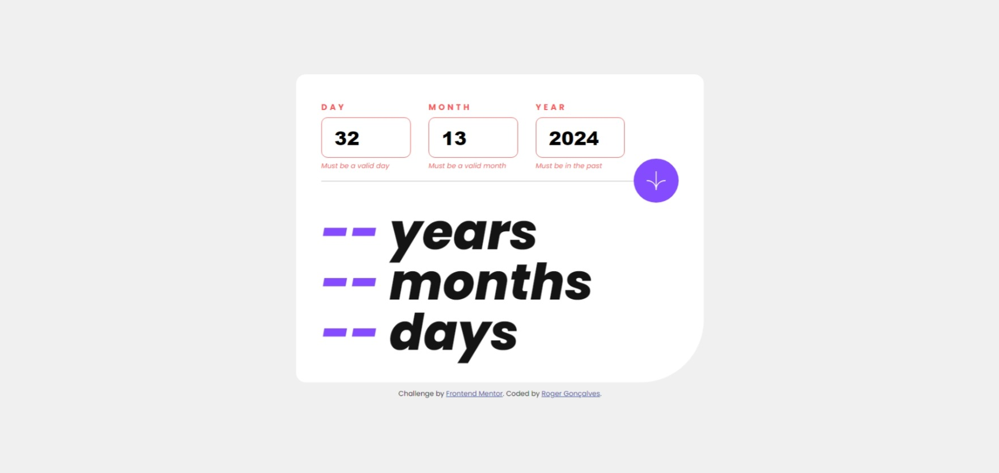
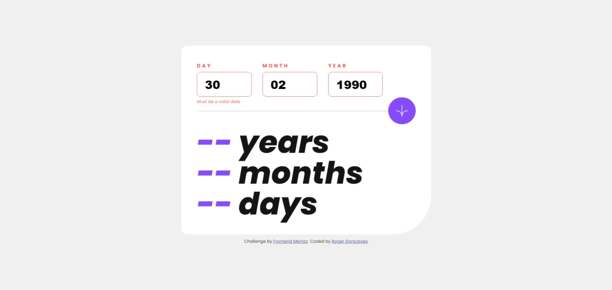

# Frontend Mentor - Age calculator app solution

This is a solution to the [Age calculator app challenge on Frontend Mentor](https://www.frontendmentor.io/challenges/age-calculator-app-dF9DFFpj-Q). Frontend Mentor challenges help you improve your coding skills by building realistic projects.

## Table of contents

- [Overview](#overview)
  - [The challenge](#the-challenge)
  - [Screenshot](#screenshot)
  - [Links](#links)
- [My process](#my-process)
  - [Built with](#built-with)
  - [What I learned](#what-i-learned)
  - [Useful resources](#useful-resources)
- [Author](#author)
- [Acknowledgments](#acknowledgments)

**Note: Delete this note and update the table of contents based on what sections you keep.**

## Overview

### The challenge

Users should be able to:

- View an age in years, months, and days after submitting a valid date through the form
- Receive validation errors if:
  - Any field is empty when the form is submitted
  - The day number is not between 1-31
  - The month number is not between 1-12
  - The year is in the future
  - The date is invalid e.g. 31/04/1991 (there are 30 days in April)
- View the optimal layout for the interface depending on their device's screen size
- See hover and focus states for all interactive elements on the page
- **Bonus**: See the age numbers animate to their final number when the form is submitted

### Screenshot








### Links

- Solution URL: [Frontend Mentor](https://www.frontendmentor.io/solutions/age-calculator-app-wGQGjqxsh1)
- Live Site URL: [GitHub Pages](https://gabirueitz.github.io/age-calculator-app/)

## My process

### Built with

- Semantic HTML5 markup
- CSS custom properties
- Flexbox

### What I learned

Browsing StackOverflow I found an interesting use when working with dates that solved two of my problems. You can see the snippet below and a brief quote from the response from the user who posted this:

```js
function daysInMonth(month, year) {
	return new Date(year, month, 0).getDate();
}
```

> "Month in JavaScript is 0-indexed (January is 0, February is 1, etc), but by using 0 as the day it will give us the last day of the prior month. So passing in 1 as the month number will return the last day of January, not February."

### Useful resources

- [JavaScript Date Objects](https://www.w3schools.com/js/js_dates.asp) - This helped me for start to work with date in JS.
- [JS to determine the number of days in a month](https://stackoverflow.com/questions/1184334/get-number-days-in-a-specified-month-using-javascript) - Carrying out this verification was a very laborious part to implement, but this discussion also helped me with the leap year issue.

## Contact Me:

[](https://github.com/gabirueitz) [](https://www.linkedin.com/in/roger-gabiru-goncalves/) [](https://www.instagram.com/gabirueitz/) [](https://www.twitter.com/gabirueitz) [](https://discord.com/users/697486281596207126)
